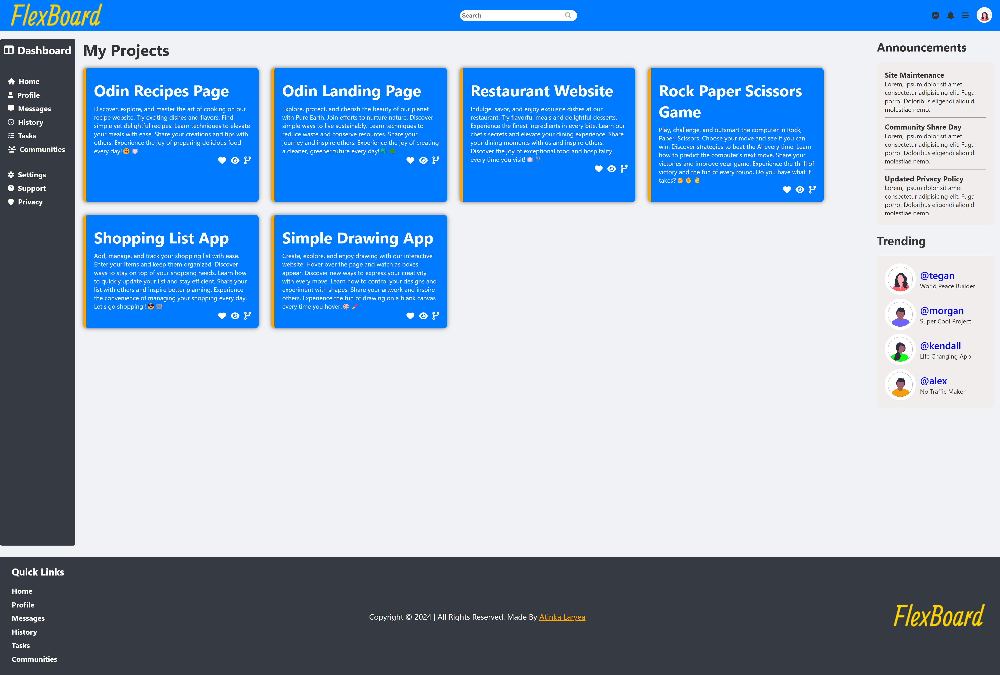

# FlexBox Dashboard

## Overview
This project was made as an inspiration form the <strong>Odin Project's Admin Dashboard Project</strong>. The actual project required the use of <strong>CSS Grid</strong> but I haven't learnt that yet so I used <strong>CSS FlexBox</strong>

## What I used
* HTML - For Page Structure
* CSS - For Page Styling
* CSS FlexBox - For Page Layout
* JavaScript - For minor functionalities within the page

## Images
All the images I used was downloaded for free at <strong><em>undraw.co</em></strong>
#### Undraw Site Link: https://www.undraw.co

## Logo
The logo was custom made by me. I used this free logo making platform called <strong>LogoMakr</strong> 
#### LogoMakr Site Link: https://logomakr.com/

## Live Link
https://atkthedeveloper.github.io/flexbox-dashboard/

## Odin Project Link
https://www.theodinproject.com/lessons/node-path-intermediate-html-and-css-admin-dashboard
